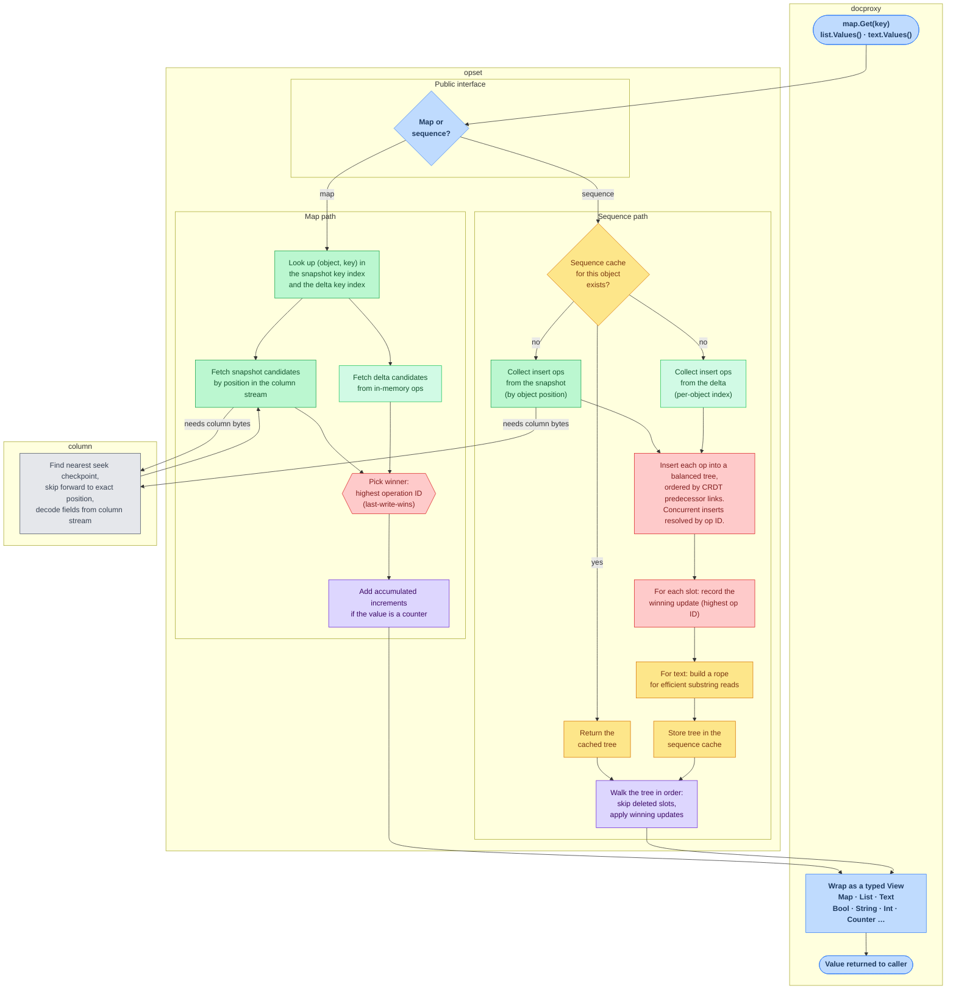
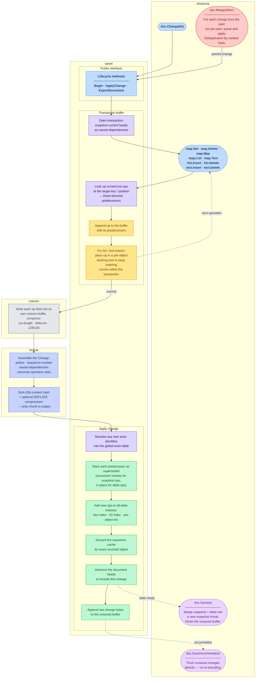

# GoToMerge — Architecture

GoToMerge is a Go implementation of the Automerge CRDT. Documents are collections of
maps, lists, and text that can be edited concurrently by multiple peers and merged
without conflicts. This page covers the static component structure and the read and
write data flows.

---

## 1. Components

Four packages, layered top-to-bottom. **docproxy** is the public entry point:
Document accesses OpSet through four distinct interfaces — direct read queries, transaction
creation, applying incoming changes, and exporting a full snapshot.
The **Txn** write handle wraps an `opset.Transaction`; on commit it
encodes the change via format + column and stores the resulting raw bytes and content hash.
**opset** is the CRDT engine: actor table & document heads, a compacted
read-only *snapshot*, an append-only in-memory *delta*, and cross-cutting
state spanning both (successor overlay, counter accumulator, sequence cache).
**format** and **column** share a bidirectional relationship —
format defines chunk structure, column handles per-field compression inside each chunk.

```mermaid
graph TB
  classDef api   fill:#bfdbfe,stroke:#3b82f6,color:#1e3a5f,font-weight:bold
  classDef store fill:#bbf7d0,stroke:#16a34a,color:#14532d
  classDef idx   fill:#ddd6fe,stroke:#7c3aed,color:#3b0764
  classDef cache fill:#fde68a,stroke:#d97706,color:#78350f,stroke-dasharray:4 2
  classDef over  fill:#e5e7eb,stroke:#6b7280,color:#374151,stroke-dasharray:2 2
  classDef fmt   fill:#c7d2fe,stroke:#2563eb,color:#1e3a5f
  classDef codec fill:#e5e7eb,stroke:#4b5563,color:#374151

  subgraph docproxy["  docproxy  "]
    direction TB
    Doc["Document\n────────────────\nActor identity for this peer\nAll applied changes (hash + raw bytes)\nUnsaved raw bytes since last Save()"]:::api
    DocTxn["Txn  (write handle)\n────────────────\nWraps opset.Transaction.\nViews carry both the OpSet (for reads)\nand the Transaction (for writes).\nOn Commit: encodes the change via\nformat+column, then stores the raw\nbytes and content hash in\nallChanges and unsaved."]:::api
    Views["Typed Views\n────────────────\nMap · List · Text\nBool · String · Int\nCounter · Bytes · Null"]:::api
    Doc --> DocTxn
    DocTxn --> Views
    Doc --> Views
  end

  subgraph opset["  opset  "]
    direction TB

    subgraph opset_api["  Public interface  "]
      direction TB
      ReadAPI["Read methods\n────────────────\nMapGet · MapKeys · MapItems\nListElements · ListGet · ListLen · Text\n\nConsult both snapshot and delta,\nresolve conflicts (highest op ID wins),\napply counter accumulator.\nSequence reads use the cache."]:::api
      LifecycleAPI["Lifecycle methods\n────────────────\nBegin(actor, seqNum) → Transaction\nApplyDocument  (on load)\nApplyChange    (on load + merge)\nAppliedHashes  (merge dedup)\nExportDocument (full save)"]:::api
    end

    subgraph opset_meta["  Identity & version  "]
      direction TB
      ActorTable["Global actor table\n────────────────\nCanonical ordered list of all\npeer identities. All operation\nIDs use indexes into this table."]:::over
      Heads["Document heads\n────────────────\nChange hashes with no known\nsuccessor. Defines the current\nversion; becomes the causal\ncontext of the next commit."]:::over
    end

    subgraph snapshot["  Snapshot  —  compacted base state, read-only after load  "]
      direction TB
      SnapOps["Column-backed operations\n────────────────\nAll operations from the last\nSave(), stored zero-copy in\nthe original binary chunk.\nEach field in its own\ncompressed column stream."]:::store
      SnapKeyIdx["Map-key index\n────────────────\nFor each (object, key): list\nof operations targeting it.\nEnables O(1) map lookups."]:::idx
      SnapIdIdx["Operation-ID index\n────────────────\nFor each operation ID: its\nposition in the column stream."]:::idx
      SeekIdx["Seek checkpoints\n────────────────\nSparse byte offsets into the\ncolumn streams. Allow jumping\nnear any position without\ndecoding from the start."]:::idx
      SnapOps --> SnapKeyIdx & SnapIdIdx & SeekIdx
    end

    subgraph opset_cross["  Cross-cutting state  "]
      direction TB
      SuccOver["Successor overlay\n────────────────\nWhen a delta op supersedes a snapshot op,\nthe snapshot cannot be edited in place.\nThis map records the extra successors\nso live-op filtering works across stores."]:::over
      CounterAcc["Counter accumulator\n────────────────\nRunning sum of all increment operations\nper counter. Applied at read time on top\nof the base value stored in the op."]:::over
      SeqCache["Sequence cache\n────────────────\nOne balanced tree per list or text object.\nBuilt lazily on first access, discarded on\neach write to that object. Sorted by CRDT\npredecessor links. Text objects also carry\na rope for efficient substring reads."]:::cache
    end

    subgraph delta["  Delta  —  changes since last save, append-only  "]
      direction TB
      DeltaOps["In-memory operations\n────────────────\nFully decoded Op structs.\nSuccessor counts updated in-place\nas new changes arrive."]:::store
      DeltaKeyIdx["Map-key index\n────────────────\nSame structure as snapshot\nkey index, updated incrementally."]:::idx
      DeltaIdIdx["Operation-ID index\n────────────────\nDirect lookup by op ID."]:::idx
      DeltaObjIdx["Per-object op list\n────────────────\nAll ops grouped by object.\nUsed when building the sequence\ncache and exporting a snapshot."]:::idx
      DeltaOps --> DeltaKeyIdx & DeltaIdIdx & DeltaObjIdx
    end

    subgraph txn["  Transaction  (exists only during a write)  "]
      direction TB
      TxnBuf["Operation buffer\n────────────────\nNew ops waiting to commit.\nEach op records the live ops\nit supersedes (predecessors).\nReads during a transaction\nuse the committed OpSet state."]:::cache
      WorkTree["Per-object working tree\n────────────────\nEager ordering state for list\nand text inserts: ensures\nconsecutive inserts land in\nthe correct CRDT positions."]:::cache
      TxnBuf --> WorkTree
    end
  end

  subgraph format["  format  "]
    direction TB
    SnapChunk["Snapshot chunk\n────────────────\nAll actors, current heads,\nchange metadata, and every\noperation in columnar form.\nReplaces all prior changes."]:::fmt
    ChangeChunk["Change chunk\n────────────────\nOne per commit: author, sequence\nnumber, causal dependencies,\noperations in columnar form.\nSelf-contained, SHA-256 signed."]:::fmt
  end

  subgraph column["  column  "]
    direction TB
    Codec["Columnar codec\n────────────────\nOne column per operation field,\ncompressed independently:\nrun-length, delta-integer,\nor LEB128.\nStateful streaming readers with\nseek checkpoints for skipping."]:::codec
  end

  %% docproxy → opset
  Doc    --> ReadAPI & LifecycleAPI
  DocTxn -- "buffers write ops" --> TxnBuf

  %% API gateway → internal structures
  ReadAPI      -. "queries" .-> SnapKeyIdx & DeltaKeyIdx & SeqCache
  LifecycleAPI -. "drives" .-> TxnBuf & SnapOps & ActorTable

  %% opset internal cross-cutting
  SuccOver   -. "overlays onto" .-> SnapOps
  CounterAcc -. "accumulated from" .-> SnapOps & DeltaOps
  SeqCache   -. "built lazily from" .-> SnapOps & DeltaOps
  TxnBuf     -. "reads committed state from" .-> SnapOps & DeltaOps

  %% opset → format
  SnapOps  -- "serialised as" --> SnapChunk
  DeltaOps -- "serialised as" --> ChangeChunk
  WorkTree -- "on commit" --> ChangeChunk

  %% format → column
  SnapChunk & ChangeChunk --> Codec
```

**Legend:**
- 🔵 **Public API** — docproxy types and opset public interface
- 🟢 **Persistent store** — snapshot (column-backed) and delta (in-memory)
- 🟣 **Index** — built at load time or updated incrementally
- 🟡 **Cache / transient** — built on demand, discarded on write *(dashed border)*
- ⬜ **Overlay** — cross-cutting state bridging snapshot and delta *(dashed border)*
- 🔷 **Binary format** — on-disk chunk structures
- ◻️ **Codec** — columnar encoding/decoding

---

## 2. Read Flow

Two shapes of reads. **Map reads** use hash indexes for direct access —
candidates from the snapshot and the delta are gathered, conflicts are resolved by picking
the highest operation ID, and counter values are augmented by the accumulator.
**Sequence reads** (list and text) go through a per-object ordered tree
that is built once from both stores and then cached until the next write to that object.

**Legend:**
- 🔵 **docproxy** — public API layer
- 🟢 **opset — snapshot** — column-backed, read via seek + decode
- 🟩 **opset — delta** — in-memory decoded ops
- 🟣 **opset — engine** — conflict resolution and accumulator logic
- 🟡 **opset — sequence cache** — lazily built ordered tree, reused until next write
- 🔴 **CRDT conflict resolution** — last-write-wins by operation ID
- ◻️ **column** — seek checkpoint + streaming column decoder

---

## 3. Write Flow

Writes are buffered in a transaction, then committed in two steps: first encoded into a
self-contained binary *change* (compressed, SHA-256 signed), then applied back
into the live state — updating indexes, marking predecessors superseded, and discarding
stale sequence caches. Persistence and peer merges both reuse the same apply step.

**Legend:**
- 🔵 **docproxy** — public API layer
- 🟣 **opset — engine** — transaction and apply logic
- 🟡 **opset — transaction buffer** — buffered ops awaiting commit
- 🟢 **opset — apply** — updating live state after a change lands
- ◻️ **column** — per-field columnar encoder
- 🔷 **format** — binary change chunk assembly and signing
- 🟪 **persistence** — Save / SaveIncremental paths
- 🔴 **merge from peer** — Merge path
